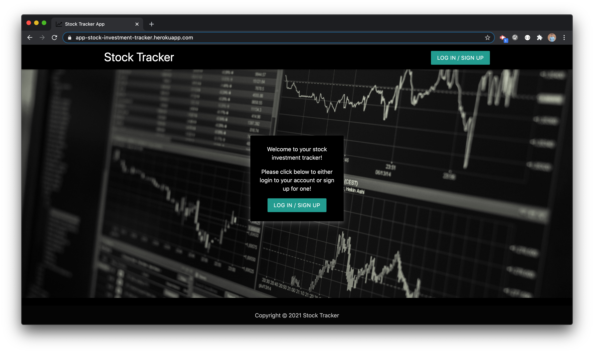
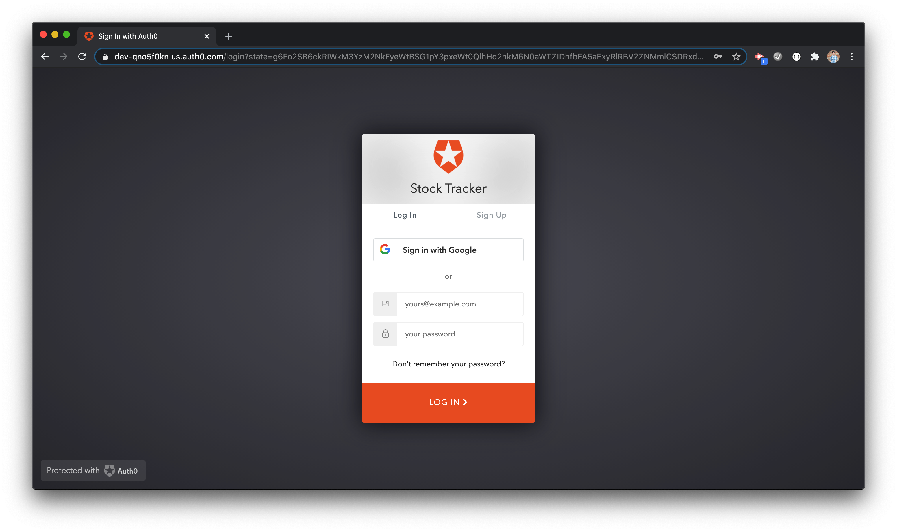
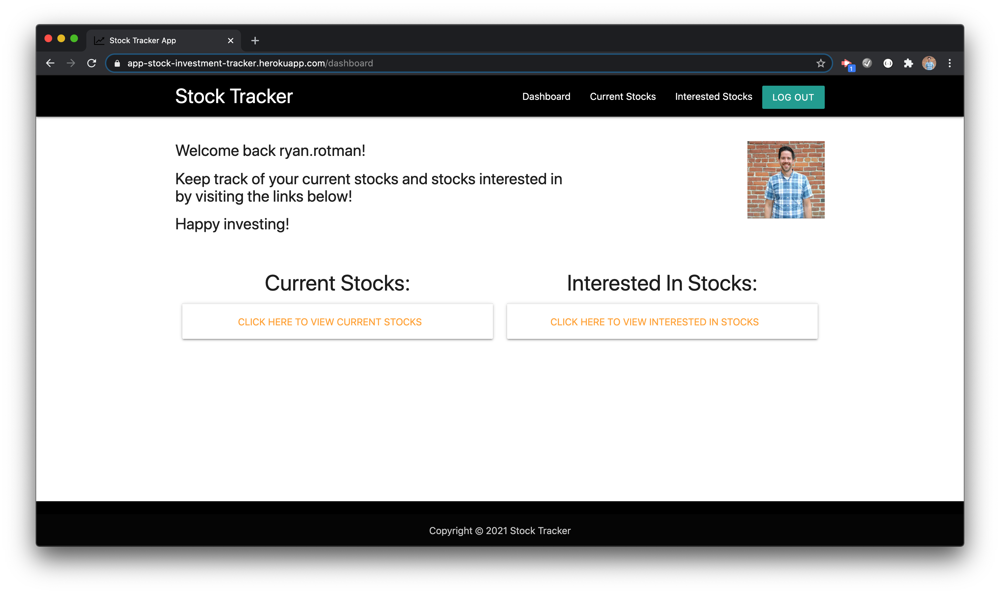
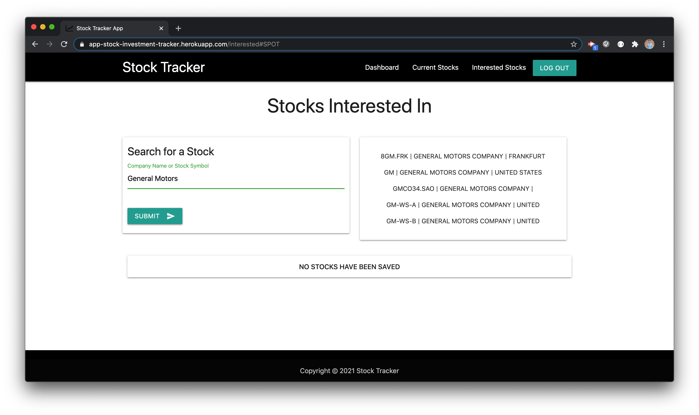
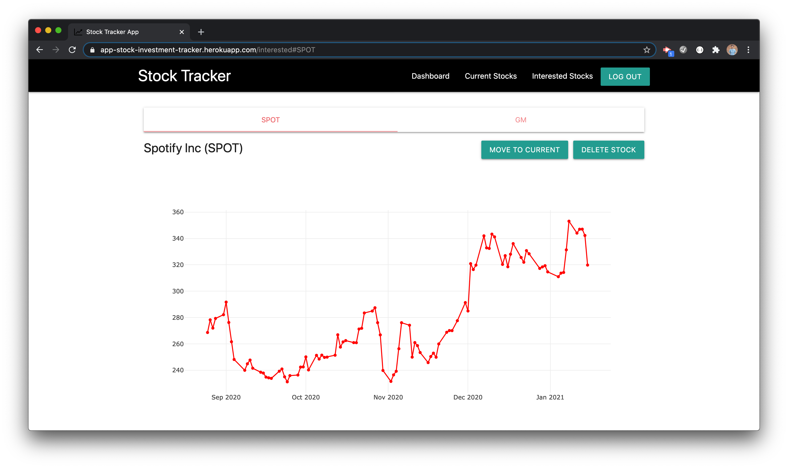

# MERN Stock Trading Application

## 📌 Description

MERN Stack based web application that allows users to search for stocks and track their performance.
Users can save stocks they are interested in and view an interactive graph showing the performance of the selected stock over the past 100 days.

This project demonstrates full-stack development using the MERN stack along with third-party APIs for real-time market data visualization.

---

## 🚀 Technologies Used

* **MongoDB** – Database
* **Express.js** – Backend framework
* **React.js** – Frontend library
* **Node.js** – Runtime environment
* **Materialize CSS** – UI styling
* **Auth0** – User authentication
* **Alpha Vantage API** – Stock market data
* **Plotly.js** – Data visualization charts
* **Moment.js** – Date formatting
* **NPM** – Package management

---

## ✨ Features

* User Authentication
* Search for stocks
* Save favorite stocks
* Interactive stock performance graphs
* Dashboard for tracking selected stocks
* Responsive user interface

---

## ⚙️ Installation

Clone the repository:

```bash
git clone https://github.com/khushi-66/mern-trading-app.git
```

Install backend dependencies:

```bash
npm install
```

Install frontend dependencies:

```bash
cd client
npm install
```

Run the application:

```bash
npm start
```

---

## Page Screenshots
Home/Login Page

User Authentication with Auth0

Dashboard/User Profile Page

Stock Search Feature

Stock Graph Feature



---

## 📚 Learning Outcomes

* Building a full-stack application using the MERN stack
* Integrating external APIs for real-time data
* Implementing authentication using Auth0
* Visualizing financial data using interactive charts

---

## 👩‍💻 Author

**Khushi**
Java Backend Developer | MERN Stack Learner

GitHub: https://github.com/khushi-66


